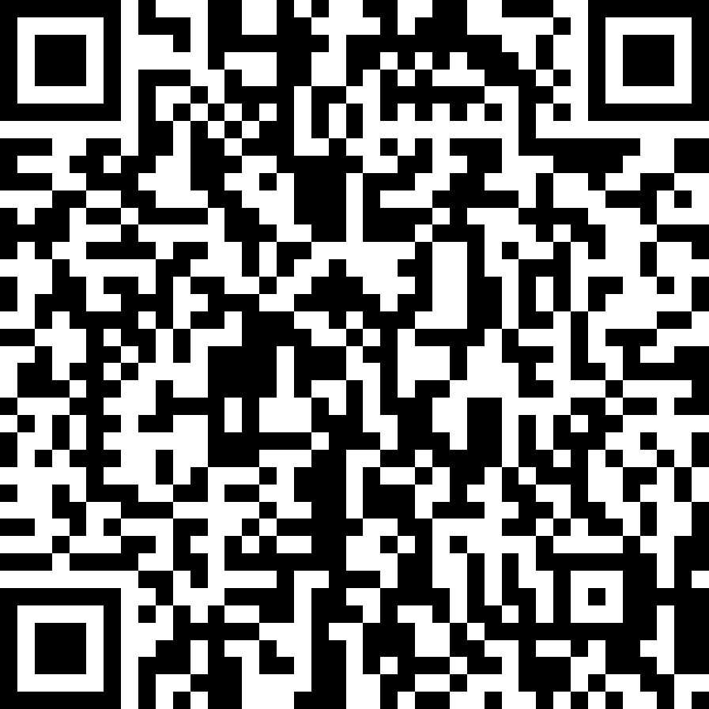
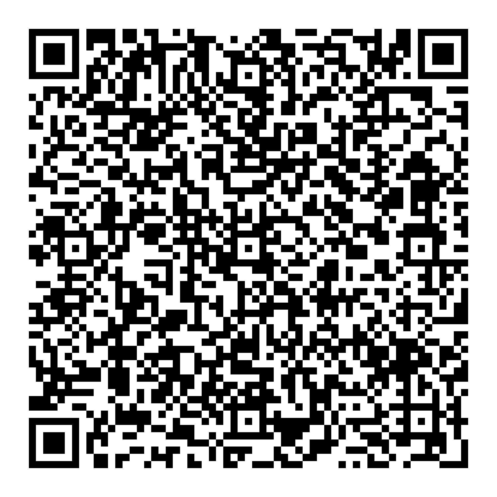

# r2fa

Rust implementation for HTOP, TOTP and steam guard tow-factor-authentication.

Use [`ring`](https://crates.io/crates/ring) `0.16.20`,
may be incompatible with other version of `ring`.

## Features

- HOTP, TOTP
  - user configurable settings
    - digits
    - secret key
    - TOTP Key time step (period)
    - TOTP Key start time (t0)
    - HOTP Key initial counter
- steam guard (not implemented yet)
  - verification
  - code generate

## Cargo Features

### qrcode

- `qrcode`
  - `qrcodegen`
  - `qrcoderead`

The `qrcode` feature is enabled by default,
need to add `default-features = false` to disable the default feature.

Or, you can enable the `qrcodegen` feature explicitly
which used to generate the qrcode with the given opt auth data.

Or, the `qrcoderead` feature
which used to read the qrcode with the given opt auth qrcode.

Both `qrcodegen` and `qrcoderead` feature use the [`image`](https://crates.io/crates/image)
crate, which will greatly increase the package size.

## Usage

### Manually Create the Struct

```rust
use libr2fa::HOTPKey;
use libr2fa::HMACType;
use libr2fa::Key;

let mut hotp_key = HOTPKey {
    key: "MFSWS5LGNBUXKZLBO5TGQ33JO5SWC2DGNF2WCZLIMZUXKZLXMFUGM2LVNFQWK53IMZUXK2A=".to_string(),
    // SHA1 is the default method, however it is deprecated
    hmac_type: HMACType::SHA1,
    ..Default::default()
};

let code = hotp_key.get_code().unwrap();
```

### From URI Formate String

```rust
use libr2fa::otpauth_from_uri;
use libr2fa::TOTPKey;
use libr2fa::HMACType;
use libr2fa::Key;

let totp_key1 = otpauth_from_uri("otpauth://totp/ACME%20Co:john.doe@email.com?secret=HXDMVJECJJWSRB3HWIZR4IFUGFTMXBOZ&issuer=ACME%20Co&algorithm=SHA256&digits=7&period=60");
if let Err(err) = totp_key1 {
    panic!("{}", err);
}
let mut totp_key1 = totp_key1.unwrap();

let mut totp_key2 = TOTPKey {
    name: "ACME Co:john.doe@email.com".to_string(),
    key: "HXDMVJECJJWSRB3HWIZR4IFUGFTMXBOZ".to_string(),
    digits: 7,
    time_step: 60,
    hmac_type: HMACType::SHA256,
    issuer: Some("ACME Co".to_string()),
    ..Default::default()
    };

assert_eq!(totp_key1.get_name(), totp_key2.get_name());
assert_eq!(totp_key1.get_type(), totp_key2.get_type());
assert_eq!(totp_key1.get_code(), totp_key2.get_code());
```

If given a opt auth struct, it can also be converted to a uri formate string.

```rust
use libr2fa::HOTPKey;
use libr2fa::HMACType;
use libr2fa::Key;

let mut hotp_key = HOTPKey {
    key: "MFSWS5LGNBUXKZLBO5TGQ33JO5SWC2DGNF2WCZLIMZUXKZLXMFUGM2LVNFQWK53IMZUXK2A=".to_string(),
    // SHA1 is the default method, however it is deprecated
    hmac_type: HMACType::SHA1,
    ..Default::default()
};

let uri = hotp_key.get_uri();
```

### From URI QRCode

See the [Cargo Features](#cargo-features) part first.

The original qrcode:


```rust
use libr2fa::otpauth_from_uri_qrcode;
use libr2fa::TOTPKey;
use libr2fa::HMACType;
use libr2fa::Key;

let totp_key1 = otpauth_from_uri_qrcode("public/uri_qrcode_test.png");
if let Err(err) = totp_key1 {
    panic!("{}", err);
}
let mut totp_key1 = totp_key1.unwrap();

let mut totp_key2 = TOTPKey {
    name: "ACME Co:john.doe@email.com".to_string(),
    issuer: Some("ACME Co".to_string()),
    key: "HXDMVJECJJWSRB3HWIZR4IFUGFTMXBOZ".to_string(),
    digits: 7,
    time_step: 60,
    hmac_type: HMACType::SHA256,
    ..Default::default()
};

assert_eq!(totp_key1.get_name(), totp_key2.get_name());
assert_eq!(totp_key1.get_type(), totp_key2.get_type());
assert_eq!(totp_key1.get_code(), totp_key2.get_code());
```

Or, generate the qrcode with the given opt auth data.

Note, all encoded image will be 2048x2048.

```rust
use libr2fa::otpauth_from_uri_qrcode;
use libr2fa::TOTPKey;
use libr2fa::HMACType;
use libr2fa::Key;
use libr2fa::OptAuthKey;

let totp_key = TOTPKey {
    name: "ACME Co:john.doe@email.com".to_string(),
    issuer: Some("ACME Co".to_string()),
    key: "HXDMVJECJJWSRB3HWIZR4IFUGFTMXBOZ".to_string(),
    digits: 7,
    time_step: 60,
    hmac_type: HMACType::SHA256,
    ..Default::default()
};

let uri = totp_key.to_uri_struct();

// convert to image::DynamicImage data
let img: image::DynamicImage = uri.into();


// Or, save to a path
uri.to_qr_code("public/uri_qrcode_encode_test.png").unwrap();
```

The encoded qrcode:

